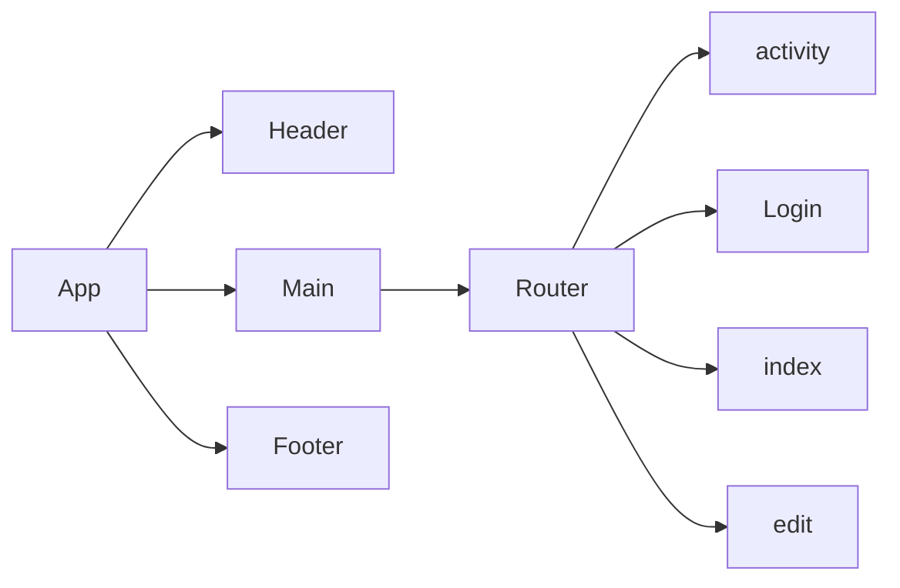

# Explore Florence

**Summary**
| Field | Detail |
|-------|--------|
| Project Name | Explore Florence|
| Description | Find activity in Florence. Register account to create, update, and delete reviews.   |
| Developers | Kelly, Fernando, Cheryl |
| Live Website | {website of deployed application} |
| Repo Frontend | https://github.com/kellyluuu/Project_3_Frontend |
| Repo Backend | {Link to git repository} |

## User Stories

List of stories users should experience when using your application.

- Users should be able to see the site on desktop and mobile
- Users can create an account
- Users can sign in to their account
- Users can create a new review
- Users can see all activies and the reviews other created
- Users can update their own review
- User can delete their own review

## List of libraries used
- react
- sass
- react-router-dom

## Route Tables

You should also include any additional notes on any special headers that may be used and so forth.

| Endpoint | Method | Response | Other |
| -------- | ------ | -------- | ----- |
| /activity | GET | JSON of all items | |
| /activity | POST | Create new item return JSON of new item | body must include data for new item |
| /activity/:id | GET | JSON of item with matching id number | |
| /activity/:id | PUT | update item with matching idea, return its JSON | body must include updated data |
| /activity/:id | DELETE | delete the item with the matching id | |
| /auth/signup | POST | creates new user account returns user JSON | new user info must be included in body 
| /auth/login | POST | logs in user and returns user JSON with JWT token | username and password must be included in body |

## Component Architecture

## User Interface Mockups

#### Index 

#### Activity 

#### Login 

