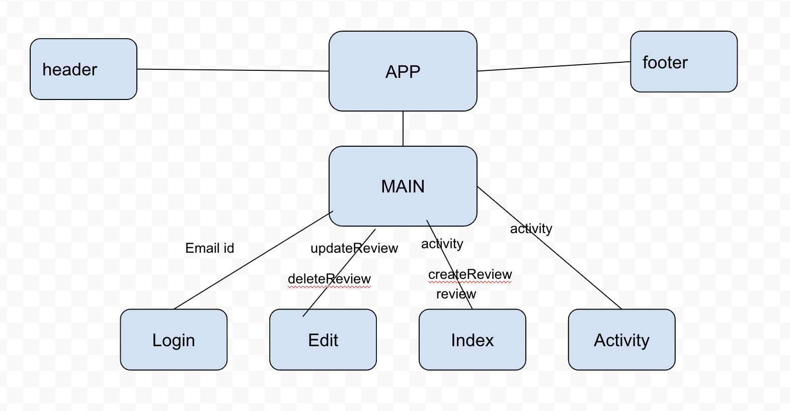
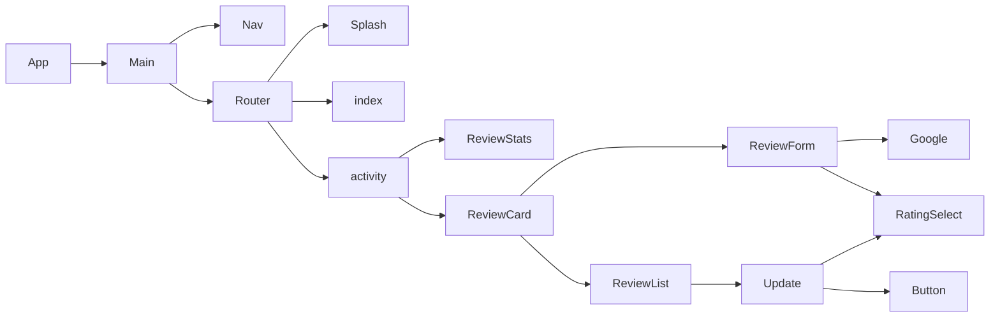
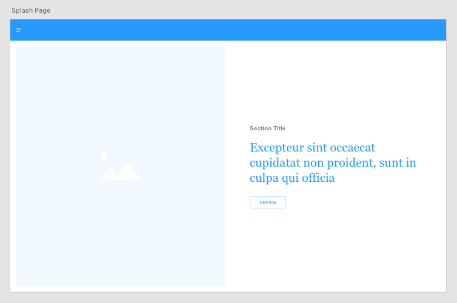
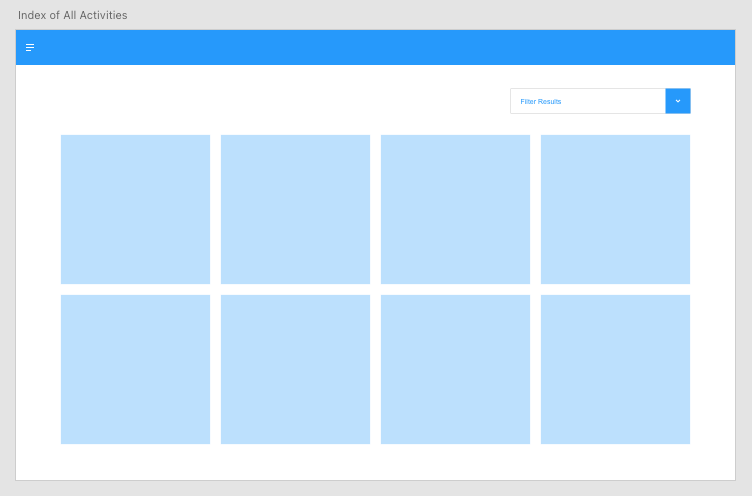
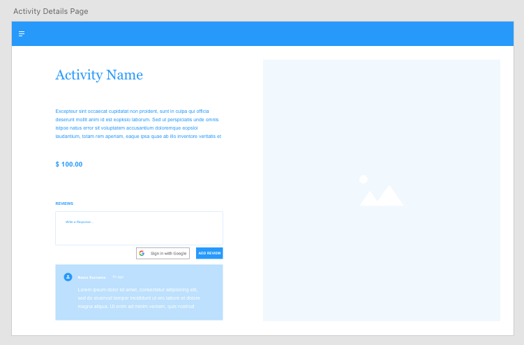

# Explore Florence

**Summary**
| Field | Detail |
|-------|--------|
| Project Name | Explore Florence|
| Description | Find things to do and where to eat in Florence, Italy. Sign in with your Google account to create, update, and delete reviews. |
| Developers | Kelly, Fernando, Cheryl |
| Live Website | https://zippy-kulfi-fedd39.netlify.app/ |
| Project Planning & Management | https://trello.com/b/8DqMFtSz/kfcproject3 |
| Repo Frontend | https://github.com/kellyluuu/Project_3_Frontend |
| Repo Backend | https://github.com/NandoLofi/Unit-3-Project-Backend |

## User Stories

List of stories users should experience when using your application.

- As a user, I should be able to see the site on desktop and mobile
- As a user, I would like to see all activies and their reviews
- As a user, I would like to filter activities by the type I'm looking for
- As a user, I would like to log in with google
- As a user, I would like to create a new review
- As a user, I would like to update my own review(s)
- As a user, I would like to delete my own review(s)

## List of technologies used

- Mongoose/MongoDB
- Express
- React
- Node
- Google OAuth login
- Javascript
- sass
- react-router-dom
- jwt-decode

## ERD

## Component Architecture

## User Interface Mockups

#### Splash

#### Index 

#### Activity/Login 

