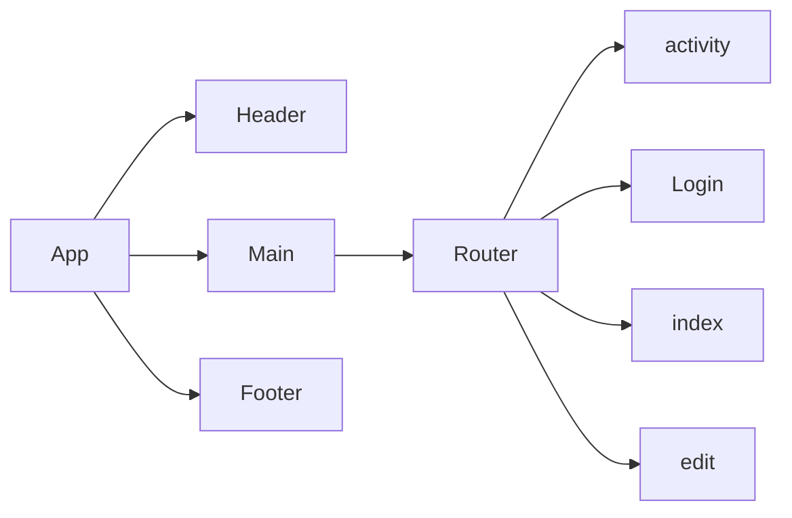

# Explore Florence

**Summary**
| Field | Detail |
|-------|--------|
| Project Name | Explore Florence|
| Description | Find activity in Florence. Register account to create, update, and delete reviews.   |
| Developers | Kelly, Fernando, Cheryl |
| Live Website | {website of deployed application} |
| Repo Frontend | https://github.com/kellyluuu/Project_3_Frontend |
| Repo Backend | {Link to git repository} |

## User Stories

List of stories users should experience when using your application.

- Users should be able to see the site on desktop and mobile
- Users can create an account
- Users can sign in to their account
- Users can create a new review
- Users can see all activies and the reviews other created
- Users can update their own review
- User can delete their own review

## List of libraries used
- react
- sass
- react-router-dom

## ERD

## Component Architecture

## User Interface Mockups

#### Index 

#### Activity 

#### Login 

